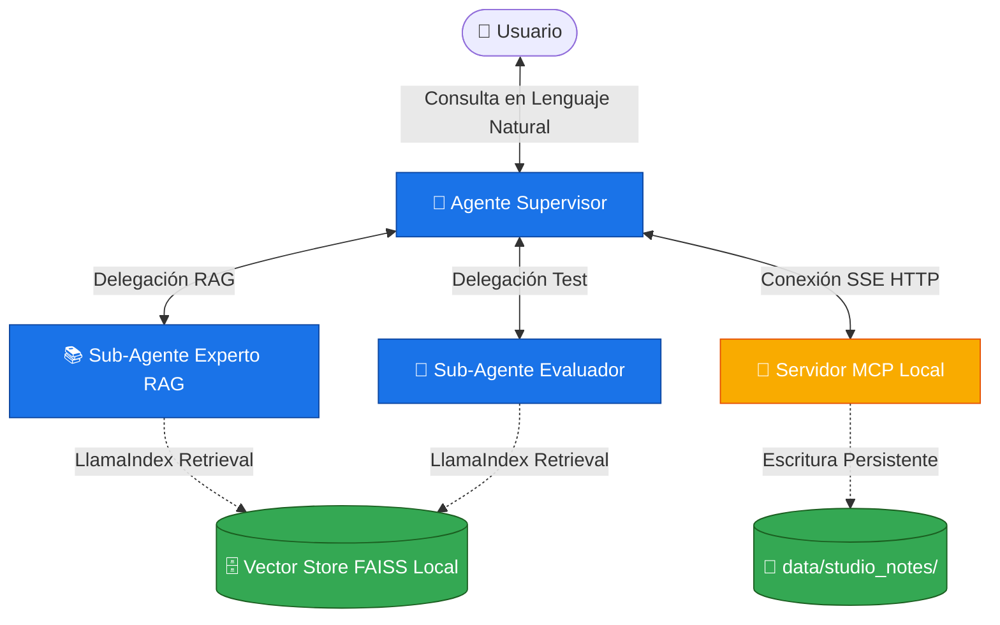

# 🏛️ Asistente de Estudio y Certificación de Google Cloud

Este proyecto es una solución completa y robusta de **Sistema Multiagente** diseñada con el **Google ADK** (Agent Development Kit), gestionada con **uv** y fundamentada en datos mediante un pipeline de **RAG local (LlamaIndex + FAISS)**. 

La solución está completamente optimizada para conectarse a **Vertex AI en Google Cloud (GCP)** a través de tu cuenta de facturación y credenciales predeterminadas (ADC), eliminando las limitaciones de cuotas de las claves de API de AI Studio.

---

## 🗺️ Diagrama de Arquitectura y Flujo



---

## 🧠 Explicación Detallada de los Componentes

El sistema se compone de **4 piezas principales** que se comunican entre sí para ofrecer una experiencia de estudio integral:

### 1. 👑 Agente Supervisor (`supervisor_agent`)
- **Archivo**: [`src/asistente_gcp/supervisor/agent.py`](file:///c:/Users/JOSE/Desktop/App%20conchita/Proyecto_mulagenteGCP/src/asistente_gcp/supervisor/agent.py)
- **Función**: Actúa como el cerebro y punto de entrada de la conversación. Utiliza el clasificador de intenciones del LLM para determinar a qué especialista delegar.
- **Herramientas**:
  - `AgentTool(rag_expert_agent)`: Para resolver dudas de conceptos técnicos.
  - `AgentTool(evaluator_agent)`: Para iniciar exámenes interactivos de prueba.
  - `McpToolset`: Consume e integra las herramientas expuestas por el servidor MCP independiente.

### 2. 📚 Sub-Agente Experto RAG (`rag_expert_agent`)
- **Archivo**: [`src/asistente_gcp/agents/rag_expert.py`](file:///c:/Users/JOSE/Desktop/App%20conchita/Proyecto_mulagenteGCP/src/asistente_gcp/agents/rag_expert.py)
- **Función**: Responder dudas conceptuales y técnicas de Google Cloud basándose estrictamente en los documentos PDF indexados en la base de datos vectorial local.
- **Mecanismo**: Utiliza un extractor `LlamaIndexRetrieval` que lee el índice FAISS. Si el documento no posee suficiente información, advierte al usuario con total transparencia.

### 📝 3. Sub-Agente Evaluador (`evaluator_agent`)
- **Archivo**: [`src/asistente_gcp/agents/evaluator.py`](file:///c:/Users/JOSE/Desktop/App%20conchita/Proyecto_mulagenteGCP/src/asistente_gcp/agents/evaluator.py)
- **Función**: Diseñar exámenes tipo test interactivos para certificar tus conocimientos.
- **Mecanismo**: Al igual que el experto RAG, consume el índice de vectores de LlamaIndex para extraer datos reales del material de estudio y estructurar preguntas con respuestas múltiples (A, B, C, D). Evalúa tus respuestas y te proporciona explicaciones rigurosas de por qué cada opción es correcta o incorrecta.

### 🔌 4. Servidor MCP Propio (`asistente-gcp-mcp-server`)
- **Archivo**: [`src/asistente_gcp/mcp_server/server.py`](file:///c:/Users/JOSE/Desktop/App%20conchita/Proyecto_mulagenteGCP/src/asistente_gcp/mcp_server/server.py)
- **Función**: Un servidor de Model Context Protocol (MCP) que se ejecuta como un microservicio independiente mediante transporte SSE (Server-Sent Events) sobre HTTP.
- **Herramienta Expuesta**: `exportar_resumen_y_progreso`. 
  - Recibe un `titulo` y `contenido` en Markdown, y un `tipo` (`resumen` o `reporte_errores`).
  - Guarda los archivos en disco dentro de subcarpetas organizadas en `data/studio_notes/resumenes` o `data/studio_notes/reportes_errores` de forma 100% persistente.

---

## 🛠️ Guía de Configuración y Despliegue Local

Sigue estos pasos para arrancar e interactuar con el proyecto en tu máquina:

### 1. Requisitos e Instalación
Asegúrate de contar con Python `>=3.10` y `uv` instalado. Ejecuta el comando de sincronización de dependencias para crear y configurar el entorno virtual:
```bash
uv sync
```

### 2. Configurar Autenticación con Google Cloud (Vertex AI)
Para facturar el consumo de cómputo y embeddings a tu cuenta de Google Cloud (GCP) utilizando las credenciales predeterminadas de tu terminal:
```bash
gcloud auth application-default login
gcloud services enable aiplatform.googleapis.com
```

### 3. Configurar tu Archivo `.env`
Duplica la plantilla y configúrala de la siguiente manera:
```env
MODEL_PROVIDER=vertex
GOOGLE_CLOUD_PROJECT=project3grupo2
GOOGLE_CLOUD_LOCATION=us-central1
STUDY_DIR=./data/studio_notes
```

### 4. Cargar e Indexar tus PDFs de Apuntes
1. **Borra** cualquier archivo de prueba en `data/apuntes/`.
2. **Pega tus apuntes reales** de Google Cloud en formato PDF dentro del directorio `data/apuntes/`.
3. Ejecuta el script indexador en tu consola:
   ```bash
   uv run notebooks/indexar_apuntes.py
   ```
   *Este script utilizará el modelo `text-embedding-004` de Vertex AI para vectorizar tus PDFs y guardará la base de datos FAISS en `data/storage/`.*

---

## 🚀 Cómo Iniciar los Servicios de la Aplicación

Para iniciar tu ecosistema multiagente, requerirás abrir dos terminales:

### Paso A: Arrancar el Servidor MCP (Terminal 1)
Inicia el microservicio de persistencia en disco:
```bash
uv run python src/asistente_gcp/mcp_server/server.py
```
*(Se mantendrá a la escucha en http://127.0.0.1:9002/sse)*

### Paso B: Lanzar la Interfaz Gráfica ADK Web (Terminal 2)
Arranca el portal web interactivo para comunicarte con tus agentes:
```bash
uv run adk web src/asistente_gcp
```
Una vez iniciado, abre tu navegador y dirígete a:
👉 **[http://localhost:8000](http://localhost:8000)**

---

## 💬 Flujos de Conversación Ideales para Probar (Casos de Uso)

Cuando interactúes con tu **`supervisor_agent`** en la interfaz web, prueba estos tres flujos clave para demostrar el potencial de tu solución:

1. **Resolución de dudas (RAG Grounding)**:
   - *Tú*: "¿Cuáles son los conceptos más importantes descritos en mis apuntes?"
   - *Resultado*: El supervisor detecta la intención de aprendizaje, delega en `rag_expert_agent`, el cual realiza una búsqueda semántica en FAISS y te devuelve la explicación exacta fundamentada en tus apuntes.

2. **Evaluación de conocimiento (Sub-agente Evaluador)**:
   - *Tú*: "Hazme un examen tipo test de 3 preguntas de opción múltiple sobre el tema de los apuntes."
   - *Resultado*: El supervisor delega en `evaluator_agent`. Este extraerá conceptos del RAG, te formulará las preguntas interactivamente, esperará a que elijas (A, B, C o D) y te dará retroalimentación detallada.

3. **Persistencia y Exportación (Servidor MCP)**:
   - *Tú*: "Genera un resumen sobre los temas de mis apuntes y guárdalo usando la herramienta de exportación."
   - *Resultado*: El supervisor delega la redacción del resumen al Experto RAG, y una vez generado, el supervisor invocará la herramienta `exportar_resumen_y_progreso` del servidor MCP para crear automáticamente el archivo `.md` estructurado en `data/studio_notes/resumenes/` de forma persistente.